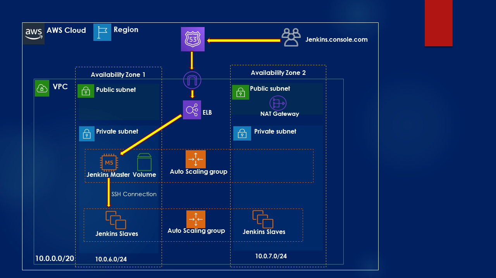

## Jenkins Cluster on AWS to automate AWS Infrastructure provisioning and Application Deployment

## Table of contents
* [General info](#general-info)
* [Technologies & AWS Services](#technologies)
* [Flow-Diagram](#flow-diagram)

## General info
This project provisions Jenkins cluster on AWS to automate infrastructure provisioning, code deployment and delivery on
multiple environments such as dev, qa and prod.

## Technologies & AWS Services
Project is created with:
* Groovy
* Terraform for IAC (Infrastructure as Code)
* Packer to automate Jenkins AMIs
* AWS EC2, Auto-scaling Group, ELB, AWS Launch-Template, Security Groups, EBS, Route53

## Flow-Diagram
